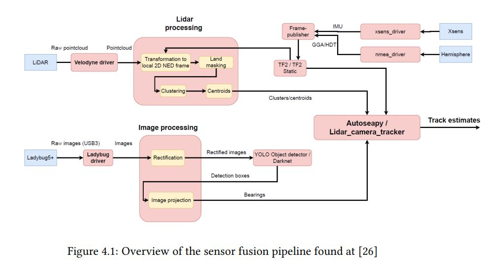

# Sensior fusion node

##Table of content
- [Overview](#Overview)
- [Packages](#Packages)
- [Interactions](#Interactions)
- [Purpose](#Purpose)
- [Sources](#Sources)

## Overview 
This node is responsible for detecting object both with image_processing and lidar_detection using sensior fusion. The sensior fusion algorithm can then be utilized with the tracking algorithme from the autosea project.  

**NOTE**: When dealing with mutliple different sensors mounted at different places, transformation and rotation matrices are requried to transform a coordinate frame *a* to *b*. The transformations between the sensors and body are constant through time and are defined as static transformations in the launch file. 

## Packages:
- frame_publisher: As of 2021 the ReVolt suffers from a loss of heading. The frame_publisher will make modification to the NED to body transform to account for this loss of heading. 
- frame_transformer: Unused.
- lidar_processing: Package to process pointcloud from the lidar. Detect landmass and objects. 
- object_detection: Package used for image processing. Will only give a line of sight angle to the target. 
- realtime_validation: Only used for validation. 

## Interactions
The sensoir fusion nodes listens to *velodyne_points* published by the velodyne node and */ladybug/camera/image_raw*. It processes the sensor inputs to then publish a track estimate. 

## Purpose  
Detect objects and landmass with a combination of lidar and camera. The sensior fusion is then combined with autosea_tracking. 

## Sources 
* Knut Turøy Thesis (2019)